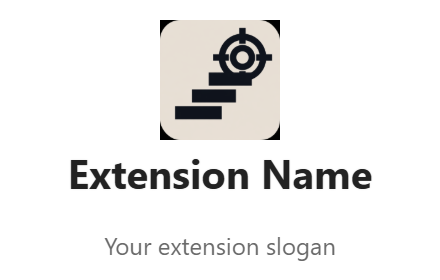

<div align="center">


<br/>

[](https://git.io/typing-svg)

<br/>


</div>

---

## 🧠 What is CodeMentor AI?

Many programmers struggle with Data Structures & Algorithms — they don't know how to start, get stuck midway, or lose motivation after repeated errors.

**CodeMentor AI** is a cross-platform browser extension that acts as a **real-time AI learning companion** on competitive programming platforms. It doesn't hand you the answer — it guides you to find it yourself.

---

## ✨ Features

<table>
<tr>
<td width="50%">

### 🔍 Smart Problem Analysis
Fetches community solutions via platform APIs and analyzes them with **Gemini / GPT**, returning:
- 💡 Problem intuition
- 🗺️ Multiple solution approaches
- 🐛 Bug analysis & code understanding

</td>
<td width="50%">

### 💬 AI Chat Companion
Chat with the AI to **validate your thinking** — without getting the answer handed to you.

> *"I think this is a sliding window problem..."*
> → AI confirms, redirects, or deepens your intuition.

</td>
</tr>
<tr>
<td width="50%">

### ⏱️ Smart Timer
Monitors your time on a problem. If you're running out of time, the system **gently offers hints or explanations** — no frustration, no demotivation.

</td>
<td width="50%">

### 🔒 Progressive Hints
Up to 3 escalating hints per problem. Solutions stay **locked until you engage** — protecting your learning process.

</td>
</tr>
</table>

---

## 🌐 Supported Platforms

<div align="center">

| Platform | Status |
|:--------:|:------:|
|  | ✅ Supported |
|  | ✅ Supported |
|  | ✅ Supported |
|  | ✅ Supported |

</div>

---

## 🛠️ Tech Stack

<div align="center">


</div>

---

## 🚀 Getting Started

### Prerequisites
- Google Chrome (or any Chromium-based browser)
- An API key for Google Gemini or OpenAI GPT

### Installation (Development)

```bash
# 1. Clone the repository
git clone https://github.com/harshitSingh1/CodeMentor.git

# 2. Open Chrome and navigate to
chrome://extensions/

# 3. Enable "Developer mode" (toggle, top right)

# 4. Click "Load unpacked" and select the cloned folder

# 5. Open LeetCode, Codeforces, HackerRank or CodeChef
#    — CodeMentor AI will appear automatically
```

---

## 📸 Preview

<div align="center">

</div>

---

## 🐍 Contribution Activity

<div align="center">

<picture>
  <source media="(prefers-color-scheme: dark)" srcset="https://raw.githubusercontent.com/harshitSingh1/CodeMentor/output/github-contribution-grid-snake-dark.svg?v=2" />
  <source media="(prefers-color-scheme: light)" srcset="https://raw.githubusercontent.com/harshitSingh1/CodeMentor/output/github-contribution-grid-snake.svg?v=2" />
  
</picture>

</div>

---

## ⚖️ Legal & Privacy (EU / GDPR)

This extension is built with **privacy by default**:

- **No personal data** is stored on external servers by this extension
- **API keys** are stored locally in `chrome.storage.local` and never transmitted outside of the respective AI provider's API
- **Platform data** (problem titles, difficulty) is fetched from publicly available APIs only
- **AI providers** process prompts under their own data processing agreements — review [Google's Privacy Policy](https://policies.google.com/privacy) and [OpenAI's Privacy Policy](https://openai.com/policies/privacy-policy) before use
- This extension does **not** use cookies, tracking pixels, fingerprinting, or third-party analytics
- Users in the EU hold rights under **GDPR (Regulation (EU) 2016/679)** — including the right to access, rectification, erasure, and data portability. To exercise these rights, open a GitHub Issue.
- Third-party services used in this README (readme-typing-svg, Capsule Render, Shields.io) process only publicly available repository metadata under their own privacy policies

> For privacy inquiries, open a [GitHub Issue](https://github.com/harshitSingh1/CodeMentor/issues).

---

## 📄 License

MIT © 2026 — See [LICENSE](LICENSE) for full terms.

---

<div align="center">


*Built with care to make DSA learning less frustrating and more human.*

</div>
